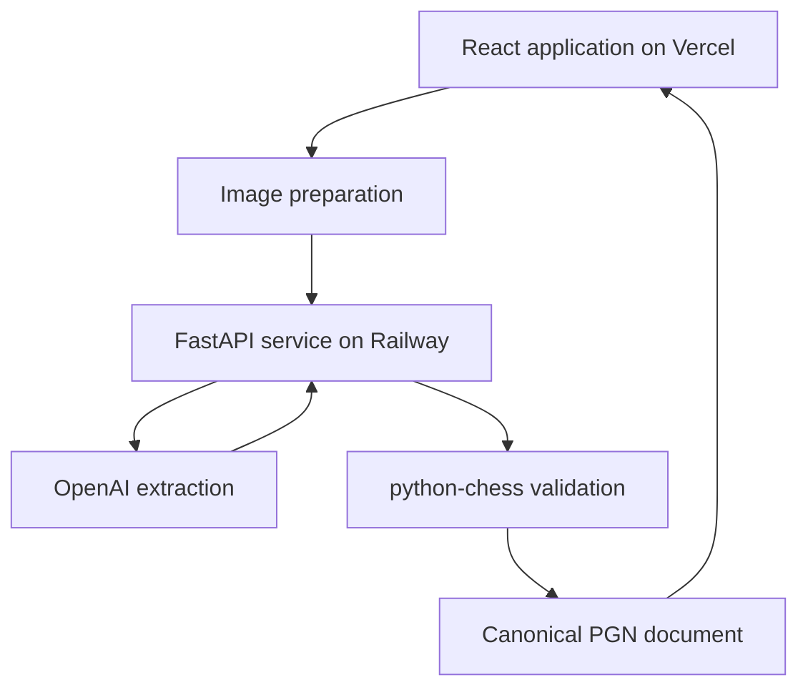
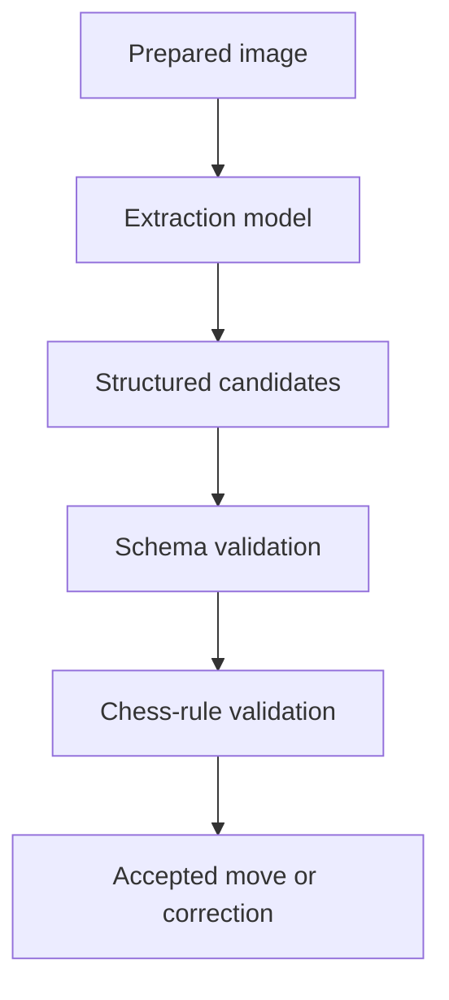

# Pgeon Architecture

This document describes Pgeon’s primary system boundaries and data flow. It intentionally omits private source code, credentials, internal addresses, and deployment configuration.

## System overview

Pgeon separates three responsibilities:

1. The React application manages image preparation, review, and editing.
2. The FastAPI backend handles provider communication, validation, and chess operations.
3. The OpenAI API analyzes prepared scoresheet images and returns structured move candidates.



## Responsibility boundaries

| Component | Responsibilities |
|---|---|
| React application | Workflow presentation, image preparation, review controls, chessboard interaction, editing, and export |
| FastAPI backend | Request validation, provider communication, response validation, move normalization, and chess operations |
| OpenAI API | Interpret the prepared scoresheet and return structured candidate moves |
| `python-chess` | Validate and apply moves against the current chess position |
| Canonical document | Represent headers, moves, variations, comments, positions, and results |

The frontend never calls the extraction provider directly and does not contain private provider credentials.

## Data flow

### 1. Image preparation

The browser validates, crops, orients, and normalizes the selected scoresheet image before extraction.

This reduces unnecessary payload size and focuses the request on the relevant scoresheet area.

### 2. Structured extraction

The prepared image is sent to FastAPI, which:

1. Validates the request.
2. Calls the extraction provider.
3. Requires a structured response.
4. Validates and normalizes the result.
5. Returns candidate moves to the review workflow.

A structurally valid response can still contain incorrect chess notation.

### 3. Legal-move review

Pgeon evaluates candidates sequentially against the current position.

A candidate is accepted only when it can be applied safely according to the game state. Review pauses when a move is illegal, missing, ambiguous, or requires a promotion choice.

The user can then inspect the board, choose a correction, undo a previous move, or continue review.

### 4. Canonical document creation

Accepted moves become part of one canonical chess document containing:

- PGN headers
- Main-line moves
- Variation branches
- Board positions
- Comments and annotations
- Game result

The board, move list, editor, and exported PGN are different interfaces to this same document.

### 5. Editing and export

The editor mutates the canonical document through defined chess operations.

When the user navigates, corrects, deletes, or promotes a variation, Pgeon restores the board position associated with the resulting selected node.

The document is serialized into PGN for export.

## Extraction and validation boundary

Image recognition is probabilistic. Chess-rule validation is deterministic.



The extraction model proposes what appears on the scoresheet. It does not have authority to mutate the final game without validation.

This boundary handles cases such as:

- Ambiguous handwriting
- Missing or duplicated moves
- Incorrect squares
- Illegal continuations
- Promotion choices
- Partial extraction results
- Provider failures

## Move-tree representation

Chess variations are represented as a tree instead of a flat move array.

Each move can have:

- A parent position
- A primary continuation
- Alternative continuations
- Comments and annotations
- A resulting board position

This supports branch navigation, variation promotion, branch deletion, undo, position restoration, and PGN serialization.

## Active session

The current beta focuses on one active browser session rather than an account-backed game library.

This keeps the product centered on extraction, review, editing, and export while reducing the amount of user data that must be stored remotely.

## Error handling

Failures become explicit application states rather than leaving the workflow partially advanced.

Handled categories include:

- Invalid or unsupported images
- Image-preparation failures
- Extraction timeouts and provider errors
- Invalid structured responses
- Missing or illegal candidate moves
- PGN parsing failures
- Invalid move-tree operations
- Network interruptions

Where possible, Pgeon preserves existing work and presents a recovery action.

## Security and privacy boundaries

- Private provider credentials remain on the backend.
- User-controlled files and request data are validated.
- Extraction output is treated as untrusted input.
- Chess moves are validated independently of the model.
- Error responses avoid exposing private configuration.

## Testing boundaries

Automated tests cover the handoffs most likely to produce inconsistencies:

```text
Image preparation → Extraction
Extraction → Schema validation
Candidate move → Legal validation
Review → Canonical document
Canonical document → Editor
Move tree → PGN export
```

Frontend tests cover workflow and interface behavior. Backend tests cover request validation, extraction responses, chess operations, PGN processing, and move-tree mutations.

## Architectural tradeoffs

### No permanent game library

The beta avoids account and persistence complexity, but unfinished browser-session work is not automatically synchronized or permanently stored.

### Review remains necessary

Independent validation prevents silent corruption, but ambiguous scoresheets may still require manual correction.

### External provider dependency

Extraction depends on network and provider availability. Legal chess processing and editing remain independent of the extraction model after candidate data is returned.

## Related documentation

- [Project overview](../README.md)